# AWS Highly Available Web Application

## 📌 Project Overview

This project demonstrates the design and implementation of a **highly available, scalable, self-healing web application architecture on AWS**.
The application is deployed across multiple Availability Zones using an **Application Load Balancer and Auto Scaling Group**. The architecture is designed to automatically distribute incoming traffic, replace failed EC2 instances, and scale the application capacity based on demand.

---

## 🎯 Objectives

The primary objectives of this project were to:

* Build a highly available web application architecture on AWS
* Deploy application servers across multiple Availability Zones
* Use an Application Load Balancer to distribute traffic
* Implement Auto Scaling for application capacity
* Demonstrate automatic recovery from EC2 instance failure
* Configure security groups following least-privilege principles
* Implement CloudWatch monitoring and SNS notifications
* Create a reusable EC2 Launch Template

---

## 🏗️ Architecture

The solution uses the following high-level architecture:

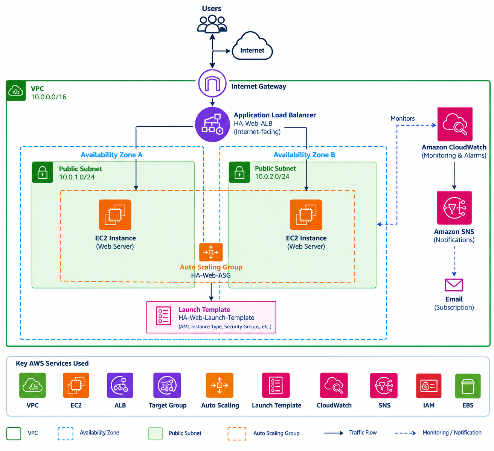

---

## ☁️ AWS Services Used

| AWS Service               | Purpose                                         |
| ------------------------- | ----------------------------------------------- |
| Amazon VPC                | Network isolation and infrastructure foundation |
| Internet Gateway          | Internet connectivity                           |
| Amazon EC2                | Web/application servers                         |
| Application Load Balancer | Traffic distribution and high availability      |
| Target Group              | Health checking and routing traffic to EC2      |
| Auto Scaling Group        | Automatic scaling and instance replacement      |
| Launch Template           | Standardized EC2 instance configuration         |
| Amazon Machine Image      | Reusable EC2 server image                       |
| Amazon CloudWatch         | Monitoring and alarms                           |
| Amazon SNS                | Email notifications                             |
| Amazon EBS                | EC2 persistent root volume storage              |

---

# 1. VPC and Network Configuration

A dedicated VPC was created for the project.

The VPC contains:

* Two Availability Zones
* Two public subnets
* Internet Gateway
* Route tables
* Security groups

The multi-AZ design provides the foundation for high availability.

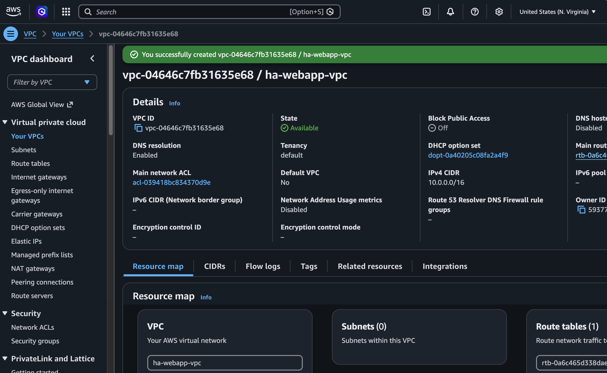
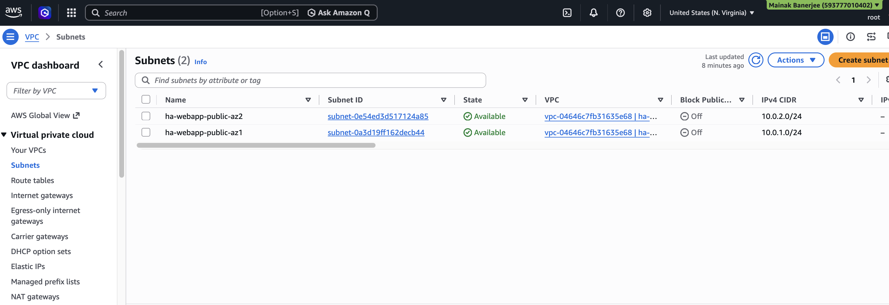
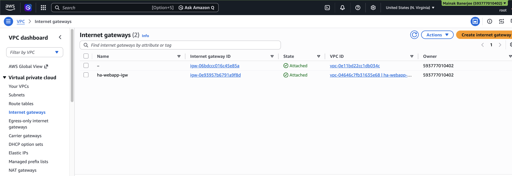
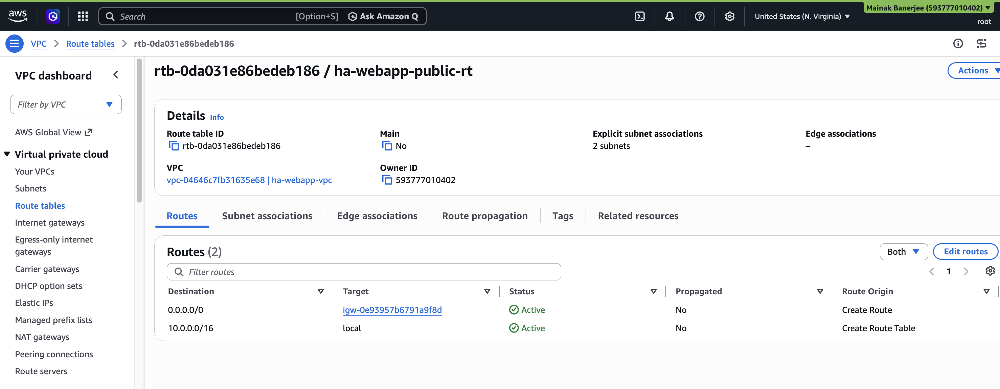
---

# 2. Security Groups

Two primary security groups were configured.

## Application Load Balancer Security Group

Inbound:

```text
HTTP (80) → 0.0.0.0/0
```

This allows internet users to reach the Application Load Balancer.

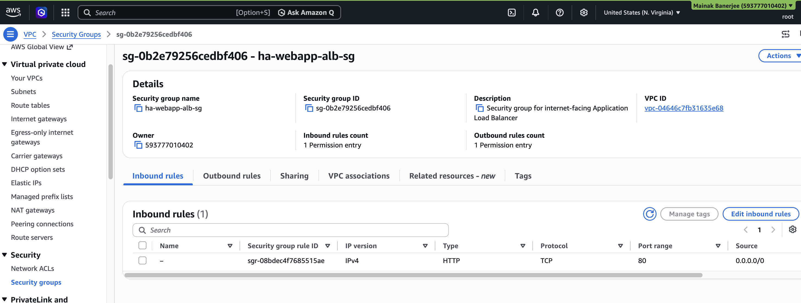

## Web Server Security Group

Inbound:

```text
HTTP (80) → HA-ALB-SG
SSH (22) → My IP
```

The web servers do not accept HTTP traffic directly from the internet.

Instead, HTTP traffic is allowed only from the Application Load Balancer security group.

This provides an additional layer of security.

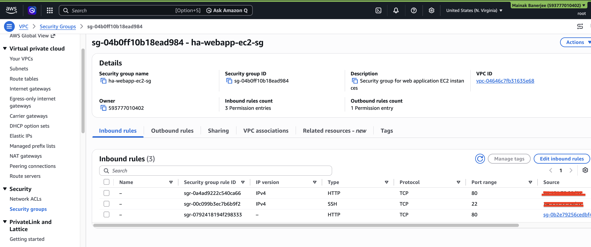

# 3. EC2 Web Servers

EC2 instances were deployed across two Availability Zones.

The web servers host a simple web application used to validate:

* Connectivity
* Load balancing
* Health checks
* Availability
* Failover

The instances were initially created manually to validate the application before introducing Auto Scaling.

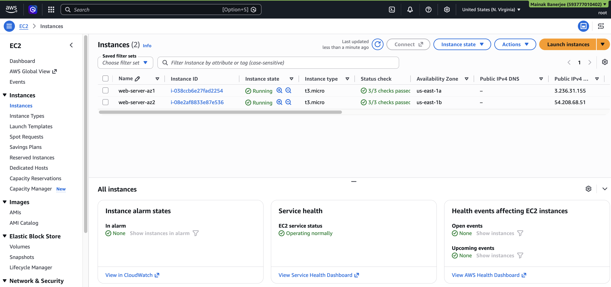
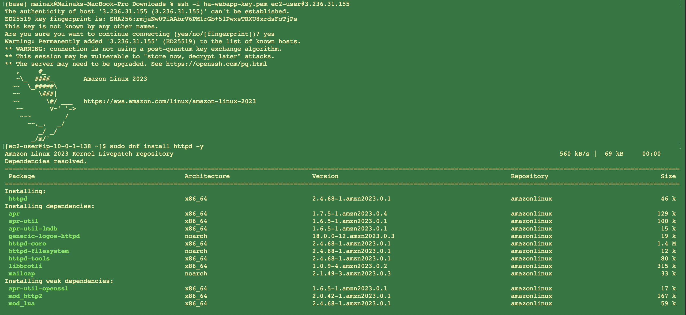
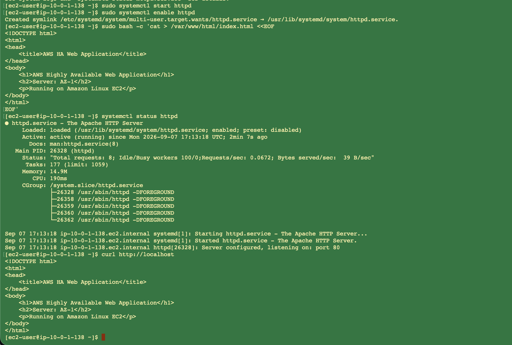
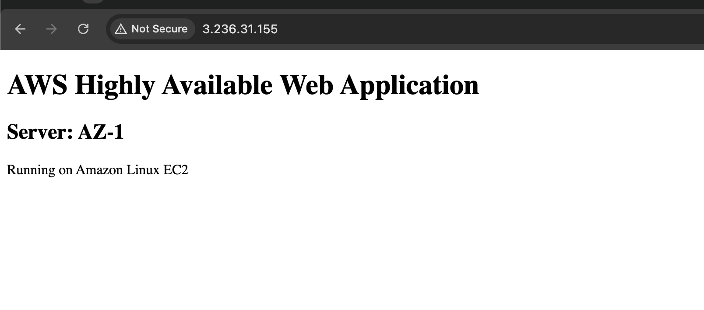


---

# 4. Target Group and Health Checks

A target group named was created for the web servers.

The target group performs health checks against the EC2 instances.

Only healthy instances receive traffic.

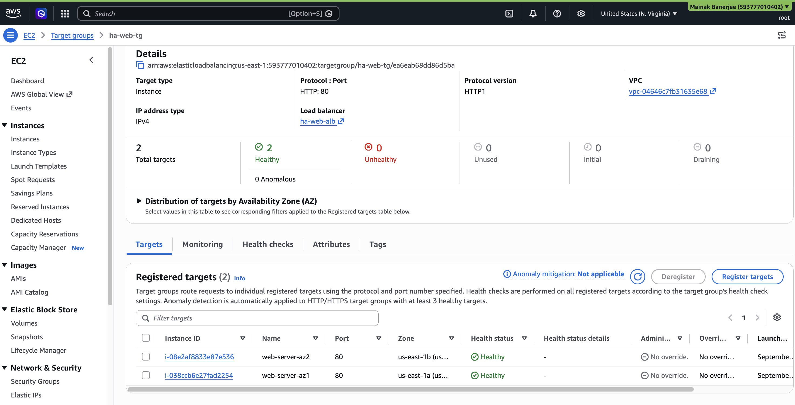

---

# 5. Application Load Balancer

An internet-facing Application Load Balancer was created.

The ALB receives HTTP requests from users and distributes them across healthy EC2 instances.

Traffic flow:

```text
User
 |
 v
Application Load Balancer
 |
 +----> EC2 Instance AZ-A
 |
 +----> EC2 Instance AZ-B
```

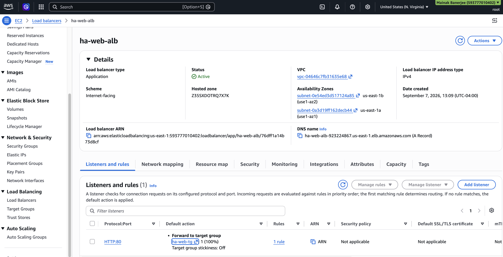

---

# 6. Application Testing

The application was tested through the Application Load Balancer DNS name.

The important architectural principle is that users access the application through the ALB rather than directly accessing the EC2 instances.

Example:

```text
Internet User
      |
      v
HA-Web-ALB
      |
      v
Healthy EC2 Instance
```

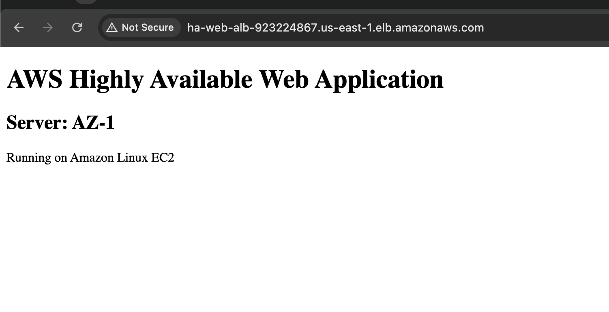

---

# 7. CloudWatch Monitoring

Amazon CloudWatch was configured to monitor EC2 CPU utilization.

The project uses CPU alarms with a threshold of:

```text
CPU Utilization > 70%
```

for five minutes.

CloudWatch provides visibility into application server resource utilization and can be extended to support automated scaling policies.

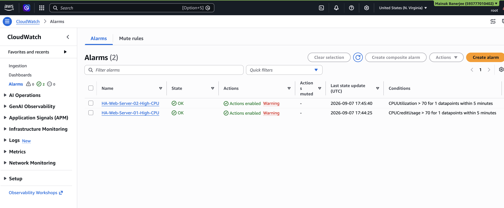

---

# 8. SNS Notifications

Amazon SNS was configured to send notifications when monitoring alarms are triggered.

An email subscription was configured and confirmed.

This provides an operational notification mechanism for infrastructure events.

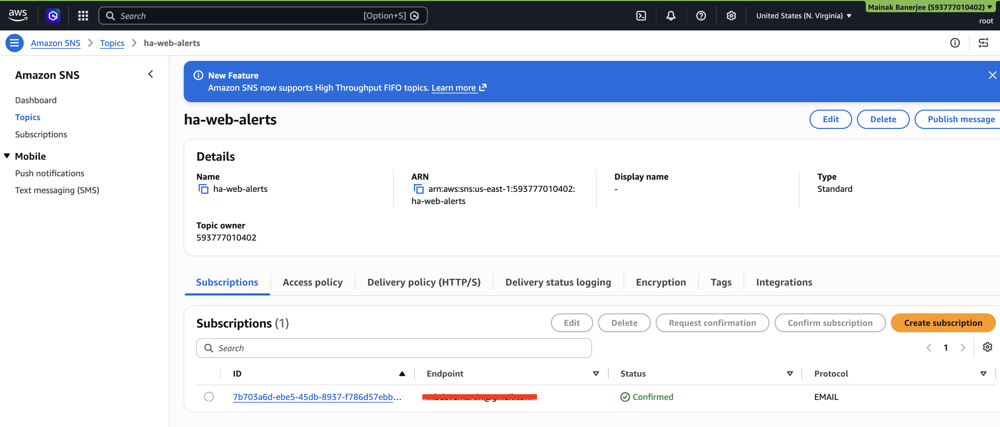

---

# 9. Launch Template

A reusable EC2 Launch Template was created

The Launch Template defines the configuration used when Auto Scaling creates new EC2 instances.

This provides consistency between instances and removes the need to manually configure every server.

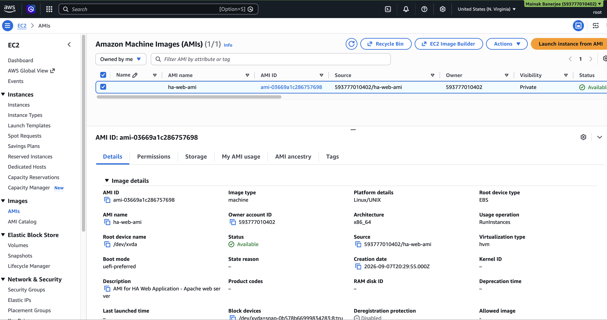
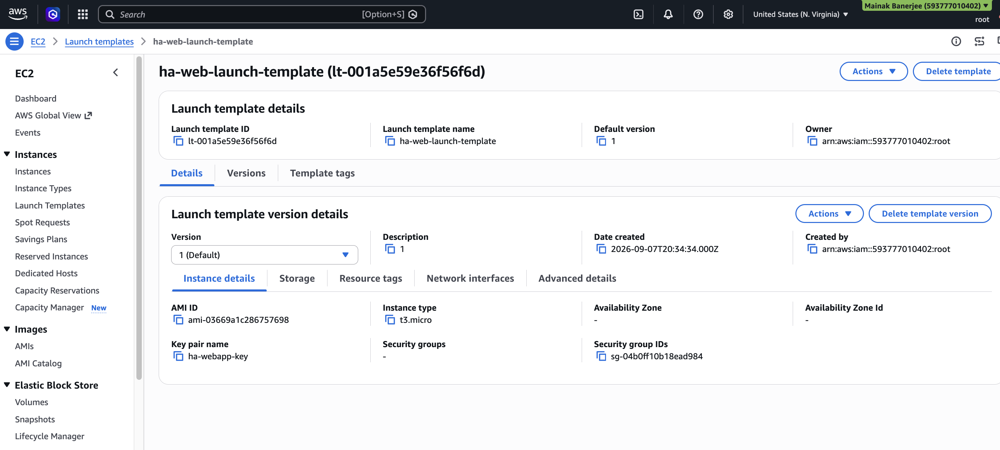

---

# 10. Auto Scaling Group

An Auto Scaling Group named was configured with:

```text
Minimum capacity: 2
Desired capacity: 2
Maximum capacity: 4
```

The instances are distributed across multiple Availability Zones.

The Auto Scaling Group provides:

* Automatic instance replacement
* Capacity management
* Multi-AZ deployment
* Self-healing capability
* Foundation for future dynamic scaling

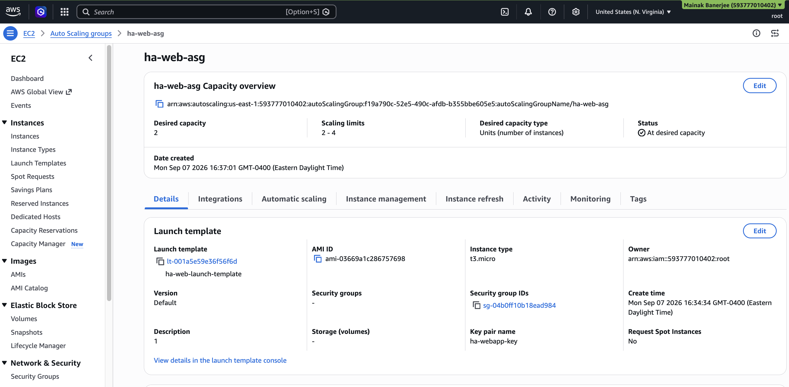
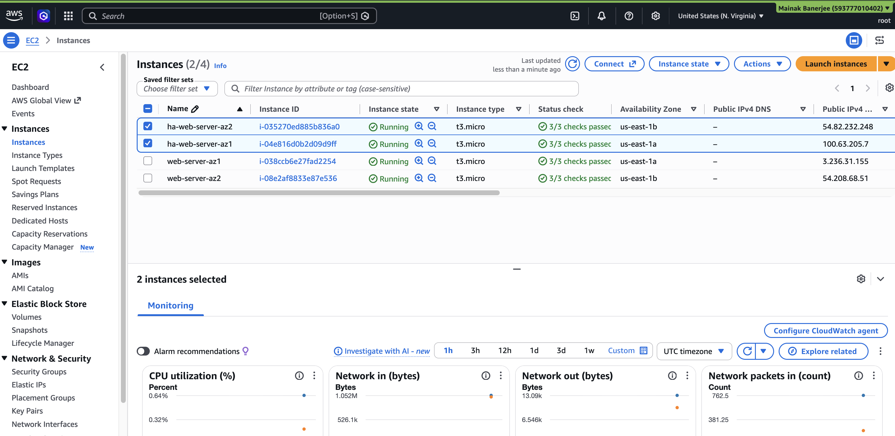
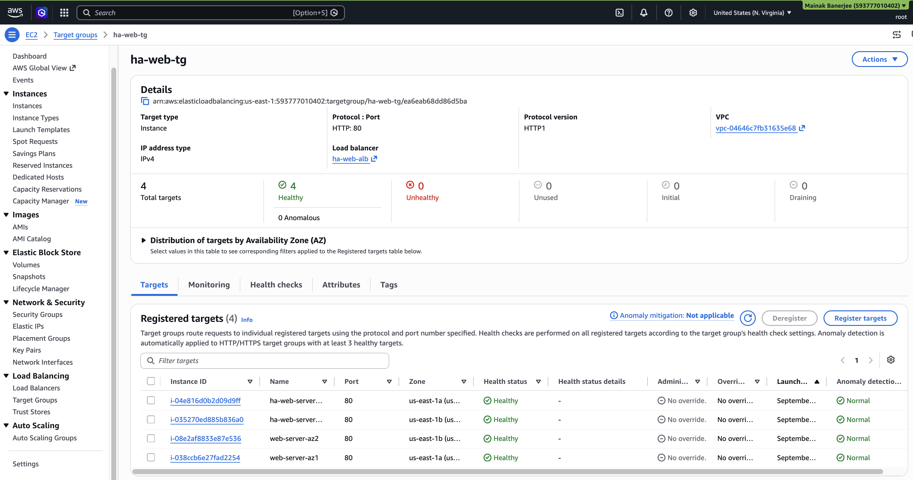

---

# 11. High Availability and Self-Healing Test

A failure simulation was performed by terminating one of the EC2 instances managed by the Auto Scaling Group.

Expected behavior:

```text
EC2 Instance Failure
        |
        v
Auto Scaling Group detects reduced capacity
        |
        v
New EC2 instance launched
        |
        v
Instance becomes healthy
        |
        v
ALB routes traffic to healthy instance
```

The Auto Scaling Group successfully launched a replacement instance.

This demonstrated the self-healing capability of the architecture.

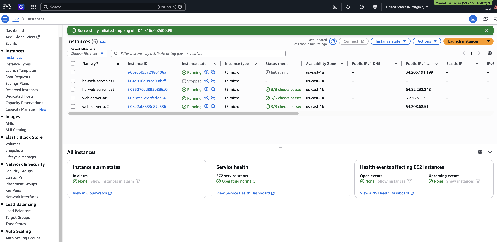
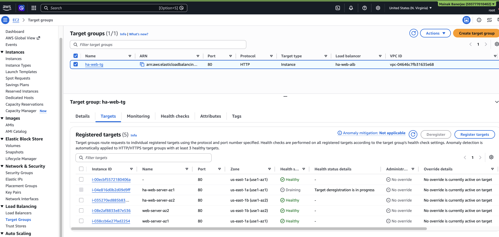

---

# 12. High Availability Test Results

| Test                              | Expected Result                | Result   |
| --------------------------------- | ------------------------------ | -------- |
| Access application through ALB    | Application loads              | ✅ Passed |
| ALB routes traffic to EC2         | Traffic reaches healthy target | ✅ Passed |
| EC2 instance failure              | ASG replaces instance          | ✅ Passed |
| Replacement instance health check | Instance becomes healthy       | ✅ Passed |
| ALB after instance replacement    | Application remains available  | ✅ Passed |

---

# 16. Future Improvements

A production-oriented version could be enhanced with:

* Private subnets for EC2 instances
* NAT Gateway for controlled outbound internet access
* HTTPS using AWS Certificate Manager
* Route 53 custom domain
* WAF protection
* RDS Multi-AZ database
* ElastiCache for session management
* S3 for static assets
* CloudFront for global content delivery
* Auto Scaling based on CPU utilization or ALB request count
* Infrastructure as Code using Terraform
* CI/CD using GitHub Actions
* Centralized logging
* AWS Systems Manager instead of SSH
* Secrets Manager for application credentials

---

