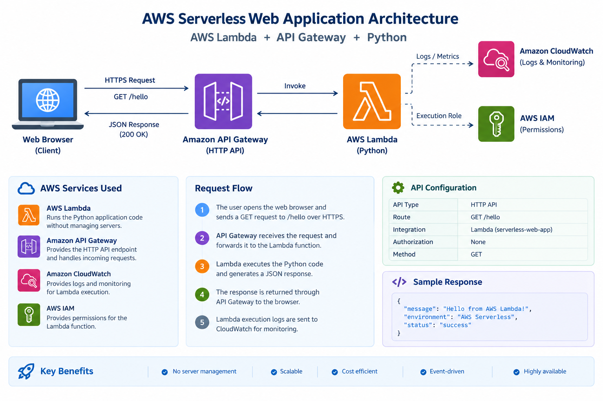
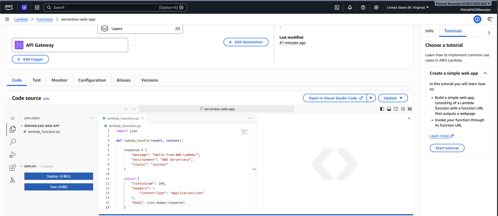
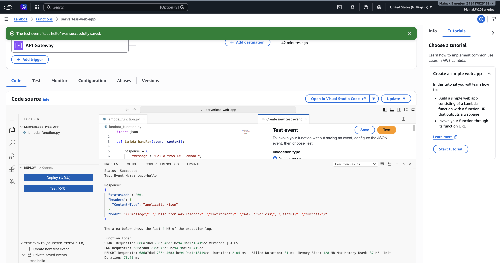
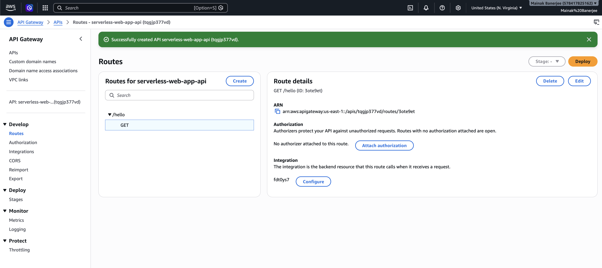
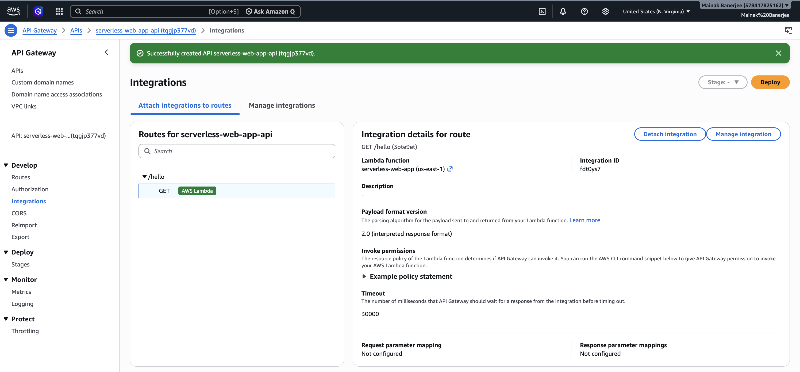
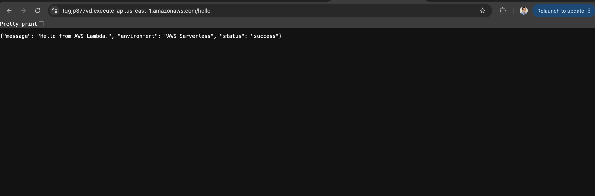

# AWS Serverless Web Application

A simple serverless web application built using **AWS Lambda, Amazon API Gateway, Python, and AWS CloudWatch**.

The project demonstrates how an HTTP request can be processed without managing or maintaining traditional servers.

## Architecture



## AWS Services Used

* **AWS Lambda** – Runs the Python application code without managing servers
* **Amazon API Gateway** – Provides the HTTP API endpoint
* **Amazon CloudWatch** – Provides Lambda execution logs and monitoring
* **AWS IAM** – Provides permissions required by the Lambda function

## Project Objectives

* Create and configure an AWS Lambda function
* Develop a Python-based Lambda handler
* Create an HTTP API using Amazon API Gateway
* Integrate API Gateway with Lambda
* Create and test a REST-style endpoint
* Invoke the serverless application through a web browser
* Understand basic serverless application architecture
* Monitor Lambda execution using CloudWatch

## Project Structure

```text
serverless-web-app/
│
├── README.md
├── lambda_function.py
│
└── screenshots/
    ├── 01-lambda-function.png
    ├── 02-lambda-code.png
    ├── 03-lambda-test.png
    ├── 04-api-gateway-route.png
    ├── 05-api-gateway-integration.png
    └── 06-web-app-response.png
```

## Lambda Function

The Lambda function is written in Python and returns a JSON response.

```python
import json

def lambda_handler(event, context):

    response = {
        "message": "Hello from AWS Lambda!",
        "environment": "AWS Serverless",
        "status": "success"
    }

    return {
        "statusCode": 200,
        "headers": {
            "Content-Type": "application/json"
        },
        "body": json.dumps(response)
    }
```

## API Gateway Configuration

The application uses an **HTTP API** in Amazon API Gateway.

### Route

```text
GET /hello
```

### Integration

```text
API Gateway → AWS Lambda
```

### Authorization

```text
None
```

Authorization is intentionally disabled for this demonstration project to keep the application simple and publicly accessible through the API endpoint.

For production applications, an appropriate authentication and authorization mechanism should be implemented.

## Testing

### 1. Lambda Test

A basic Lambda test event was created using:

```json
{}
```

The Lambda function successfully returned a `200` response.

### 2. API Gateway Test

The API Gateway endpoint was accessed using:

```text
GET /hello
```

The endpoint successfully invoked the Lambda function.

### 3. Browser Test

The API endpoint can be accessed directly from a web browser.

Example response:

```json
{
  "message": "Hello from AWS Lambda!",
  "environment": "AWS Serverless",
  "status": "success"
}
```

## Screenshots

### Lambda Function



### Lambda Test



### API Gateway Route



### API Gateway Integration



### Web Application Response



## Key Concepts Demonstrated

* Serverless computing
* AWS Lambda
* API Gateway HTTP APIs
* REST-style API endpoints
* Python serverless applications
* IAM permissions
* CloudWatch logging
* Event-driven architecture
* API-to-Lambda integration

## Future Enhancements

The project can be extended into a more complete serverless application by adding:

* **Amazon S3** for hosting a frontend
* **Amazon DynamoDB** for persistent data storage
* Lambda functions for CRUD operations
* API Gateway routes for `GET`, `POST`, `PUT`, and `DELETE`
* CloudWatch monitoring and alarms
* Authentication using Amazon Cognito
* Infrastructure as Code using Terraform
* CI/CD deployment using GitHub Actions

## Learning Outcome

This project provides hands-on experience building and deploying a basic **serverless application on AWS**, demonstrating how API Gateway and Lambda can be combined to create scalable applications without managing underlying servers.

