# AWS Infrastructure Deployment using Terraform

## Overview

This project demonstrates how to provision and manage AWS infrastructure
using **Terraform (Infrastructure as Code)**.

The project creates a custom VPC with public and private subnets,
Internet Gateway, route tables, security controls, an IAM role, and an
Amazon Linux EC2 web server running Apache.

The infrastructure was built incrementally with Terraform and verified
through the AWS Console, Terraform state, outputs, and end-to-end web
server testing.

## Architecture

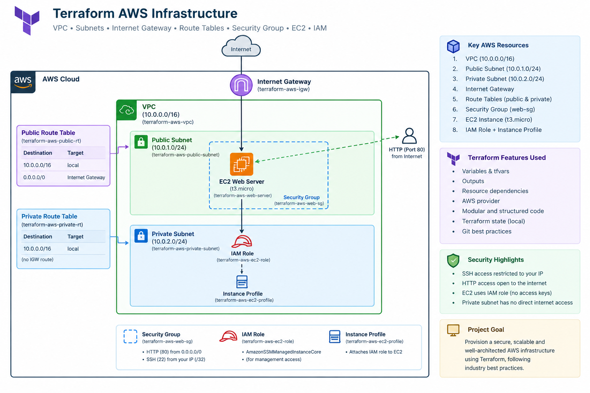

```

> Note: The private subnet is included to demonstrate VPC network
> segmentation. This project does not use a NAT Gateway, so the private
> subnet has no direct Internet access.

## AWS Resources

Terraform provisions and manages:

-   **VPC** --- `10.0.0.0/16`
-   **Public Subnet** --- `10.0.1.0/24`
-   **Private Subnet** --- `10.0.2.0/24`
-   **Internet Gateway**
-   **Public Route Table**
-   **Private Route Table**
-   **Security Group**
    -   HTTP (TCP/80) from `0.0.0.0/0`
    -   SSH (TCP/22) restricted to the administrator's public IP `/32`
    -   All outbound traffic
-   **EC2 Instance**
    -   Amazon Linux 2023
    -   `t3.micro`
    -   Apache HTTP server
-   **IAM Role and Instance Profile** for EC2
-   Terraform outputs for infrastructure IDs and the web server URL

## Terraform Concepts Demonstrated

-   Infrastructure as Code (IaC)
-   AWS provider configuration
-   Terraform variables and outputs
-   Resource dependencies
-   AWS VPC networking
-   Public and private subnets
-   Internet Gateway and route tables
-   Security groups with dedicated ingress/egress rules
-   EC2 provisioning
-   EC2 `user_data`
-   IAM roles and instance profiles
-   Terraform state management
-   `terraform init`, `validate`, `plan`, `apply`, and `destroy`
-   Git/GitHub best practices
-   `.gitignore` for Terraform state and local configuration

## Project Structure

``` text
terraform-aws-infrastructure/
├── main.tf
├── providers.tf
├── variables.tf
├── outputs.tf
├── terraform.tfvars.example
├── .gitignore
└── screenshots/
```

> `terraform.tfvars` and Terraform state files are kept local and are
> excluded from Git.

## Prerequisites

-   AWS account
-   AWS CLI configured with appropriate credentials
-   Terraform installed
-   Git installed
-   An AWS region selected for deployment

Verify Terraform:

``` bash
terraform version
```

Verify AWS CLI:

``` bash
aws sts get-caller-identity
```

## Configuration

Create a local variables file from the example:

``` bash
cp terraform.tfvars.example terraform.tfvars
```

Update the local file with your configuration:

``` hcl
aws_region          = "us-east-1"
project_name        = "terraform-aws"
vpc_cidr            = "10.0.0.0/16"
public_subnet_cidr  = "10.0.1.0/24"
private_subnet_cidr = "10.0.2.0/24"

admin_ip      = "YOUR_PUBLIC_IP/32"
instance_type = "t3.micro"
```

The actual `terraform.tfvars` file is intentionally excluded from Git.

## Deployment

### 1. Initialize Terraform

``` bash
terraform init
```

### 2. Format the configuration

``` bash
terraform fmt
```

### 3. Validate the configuration

``` bash
terraform validate
```

### 4. Review the deployment plan

``` bash
terraform plan
```

### 5. Deploy the infrastructure

``` bash
terraform apply
```

Review the plan and confirm with:

``` text
yes
```

### 6. View Terraform outputs

``` bash
terraform output
```

### 7. Test the web server

``` bash
terraform output -raw web_url
```

Open the returned URL in a browser.

The EC2 instance installs Apache automatically through `user_data`.

You can also test from the command line:

``` bash
curl "$(terraform output -raw web_url)"
```

## Security Configuration

The web server security group uses the following rules:

  Protocol     Port Source
  ---------- ------ -------------------------------
  HTTP           80 `0.0.0.0/0`
  SSH            22 Administrator public IP `/32`
  Outbound      All `0.0.0.0/0`

SSH is restricted to the administrator's public IP rather than exposing
port 22 to the entire Internet.

The EC2 instance uses an IAM role and instance profile rather than
storing AWS access keys on the server.

## Terraform State and Git Best Practices

Terraform state is maintained locally for this demonstration project.

The repository excludes:

``` text
.terraform/
*.tfstate
*.tfstate.*
*.tfvars
*.tfvars.json
```

The repository includes:

``` text
terraform.tfvars.example
```

so the project can be configured without committing local
environment-specific values.

## Screenshots

The project includes screenshots documenting the main stages of the
Terraform workflow.

### Terraform Setup

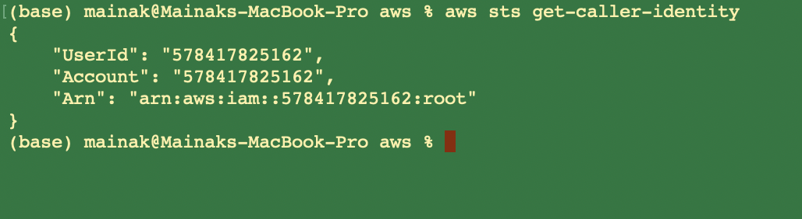

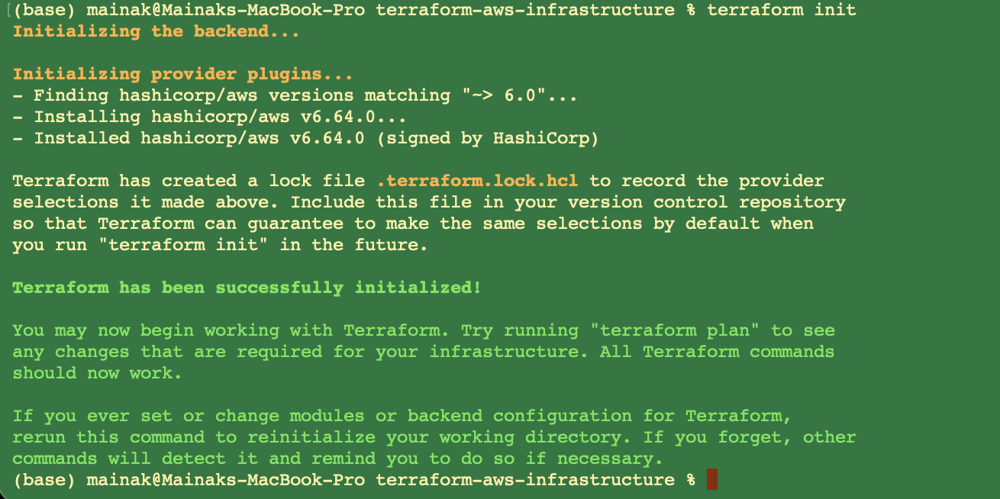

### Network Infrastructure

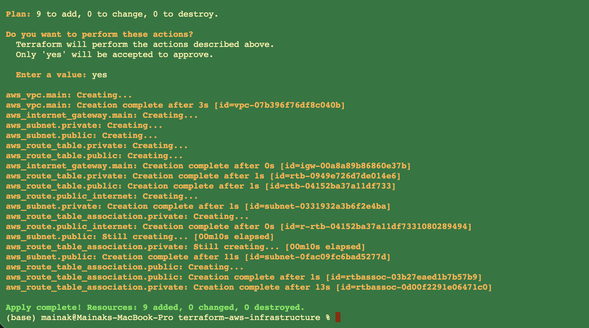

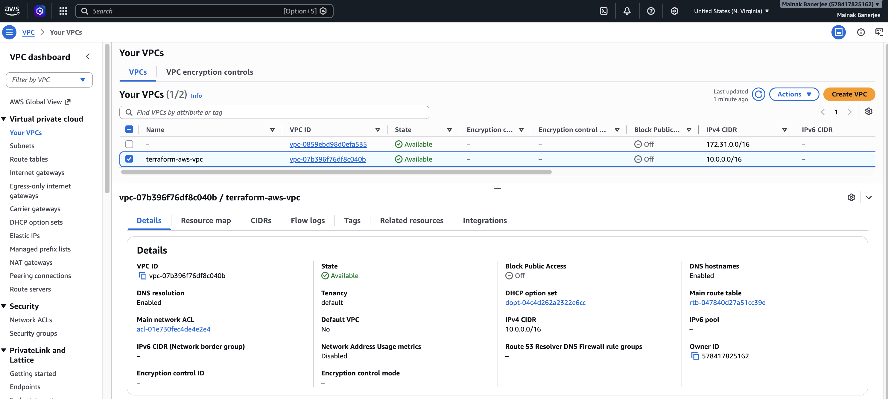

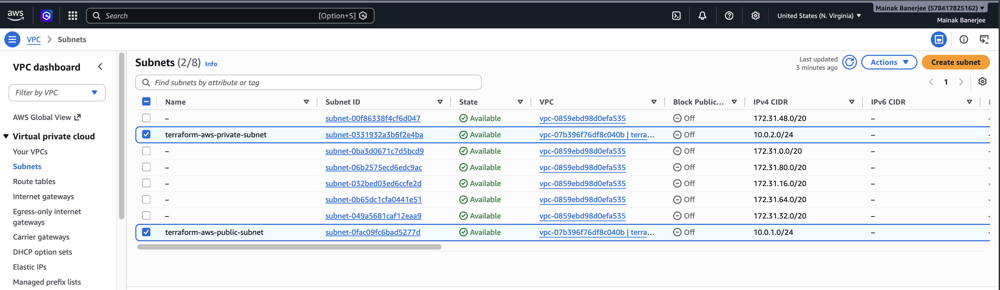

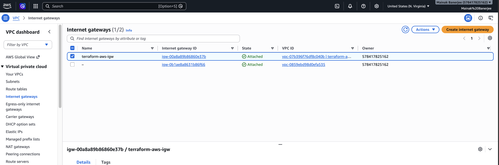

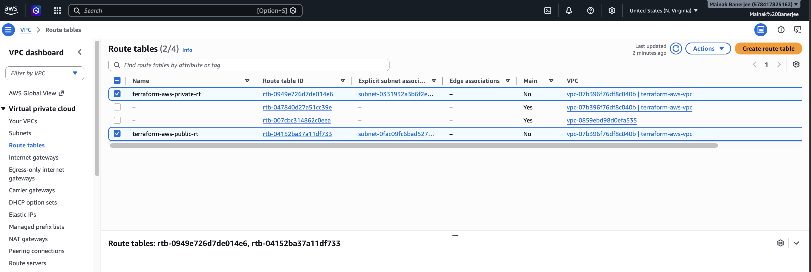

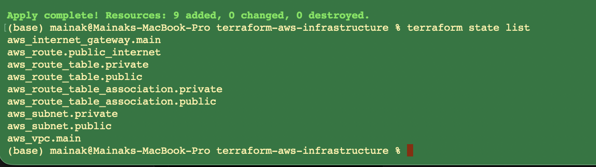


### Security Group

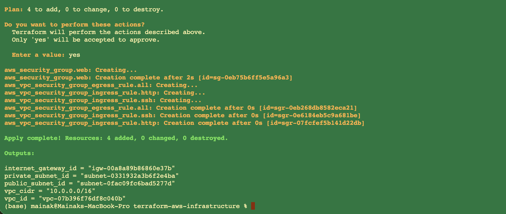

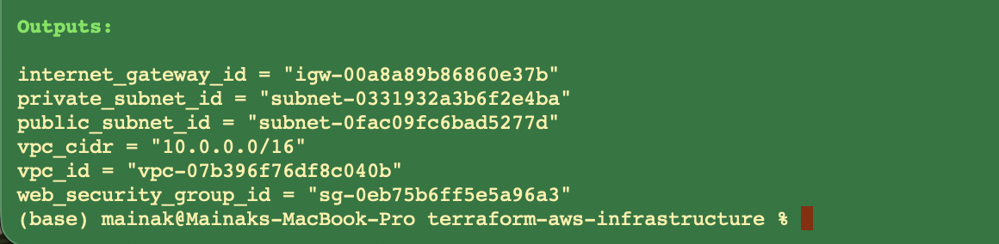


### EC2 and Web Server

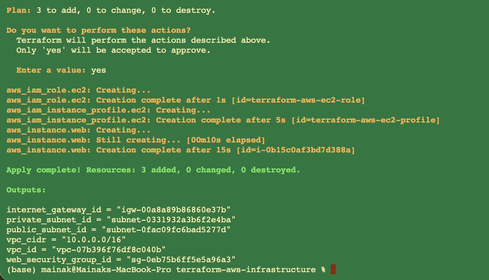

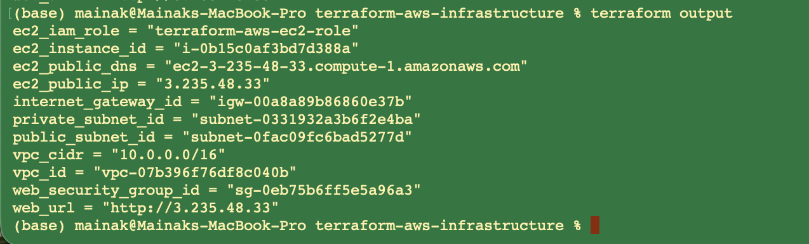

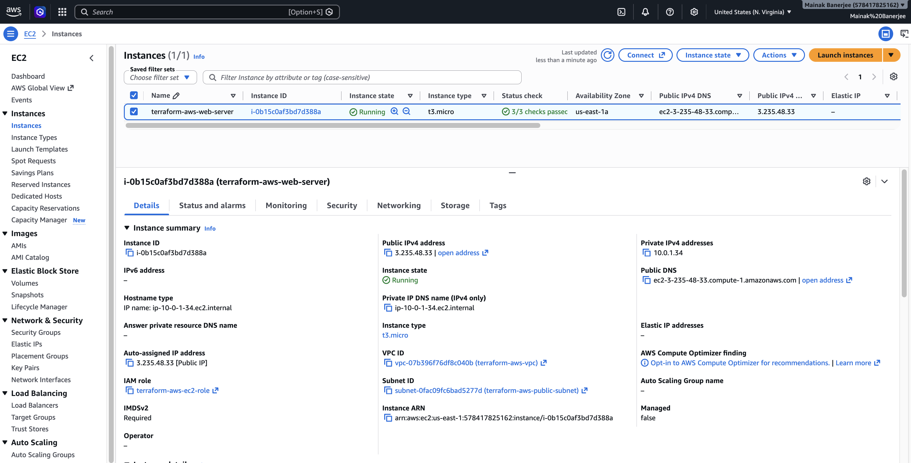

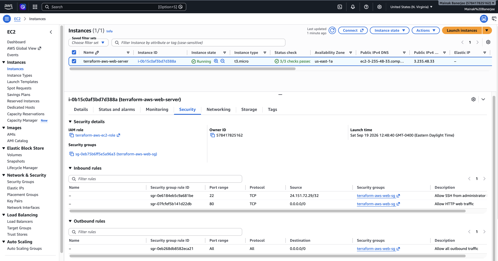

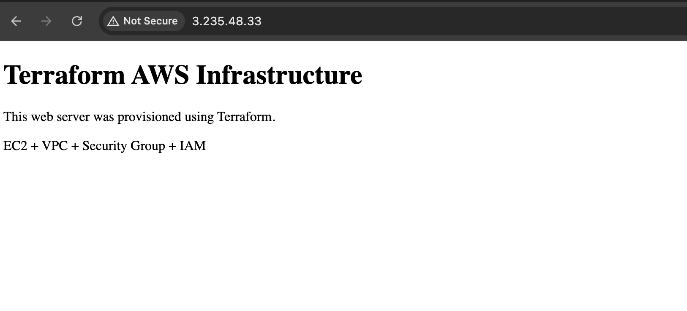

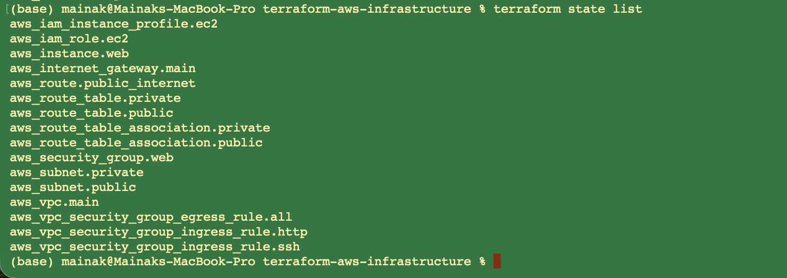

### Cleanup

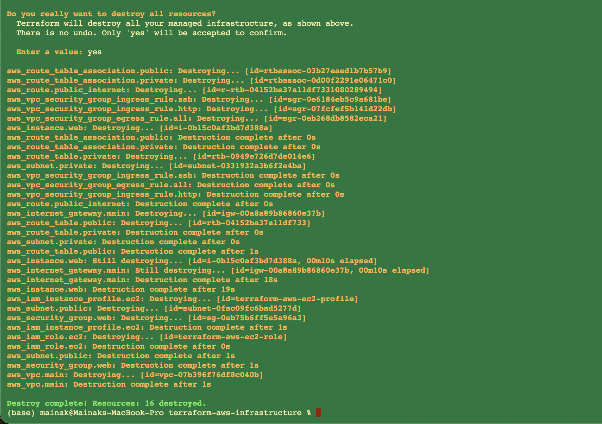

## Terraform Workflow

``` text
Terraform Configuration
        |
        v
terraform init
        |
        v
terraform validate
        |
        v
terraform plan
        |
        v
terraform apply
        |
        v
AWS Infrastructure
        |
        v
terraform output
        |
        v
terraform destroy
```

## Cleanup

When the infrastructure is no longer needed:

``` bash
terraform destroy
```

Review the resources Terraform plans to remove and confirm with:

``` text
yes
```

After destruction, verify in the AWS Console that the Terraform-created
resources have been removed.

## Key Takeaways

This project provides hands-on experience with:

-   AWS networking
-   VPC design
-   Public/private subnet configuration
-   Route tables and Internet Gateway
-   Security group configuration
-   EC2 provisioning
-   IAM roles
-   Apache web server deployment
-   Terraform Infrastructure as Code
-   Terraform state management
-   Git/GitHub infrastructure best practices

## Project Status

**Completed**

-   AWS infrastructure provisioned using Terraform
-   EC2 web server deployed and tested
-   Terraform state verified
-   Terraform outputs verified
-   GitHub repository organized using Terraform best practices
-   Infrastructure successfully destroyed after testing
